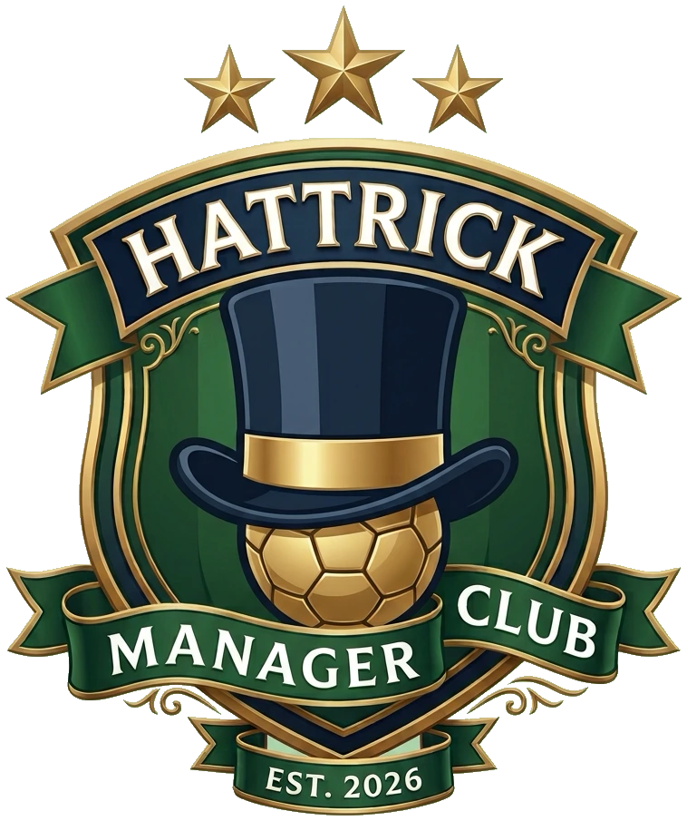
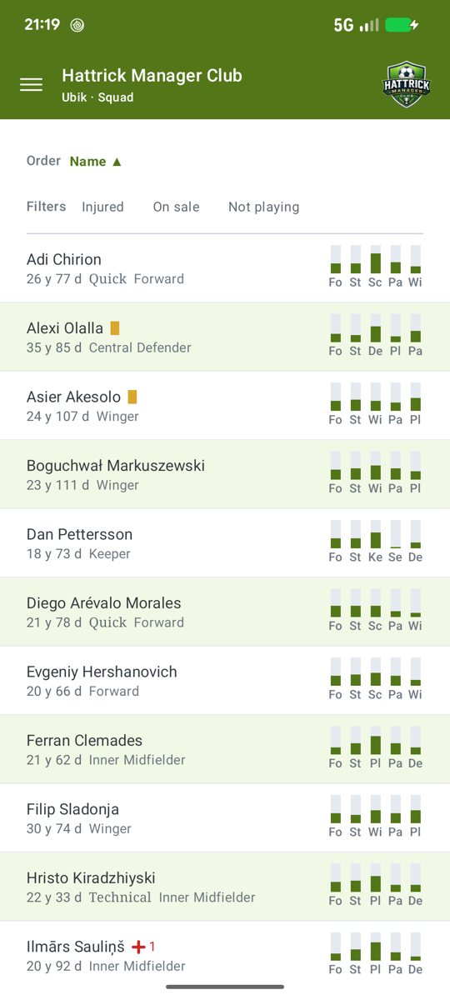
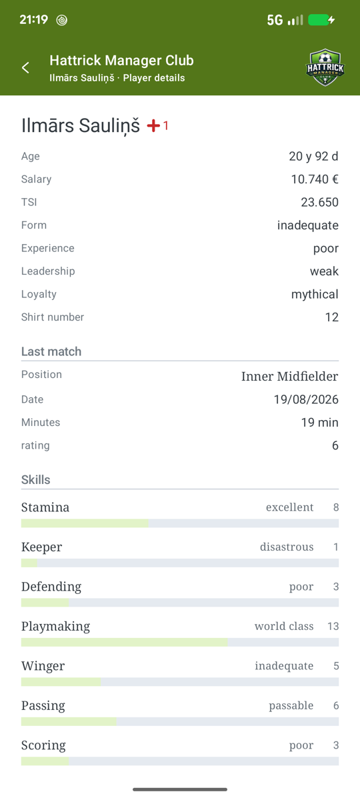
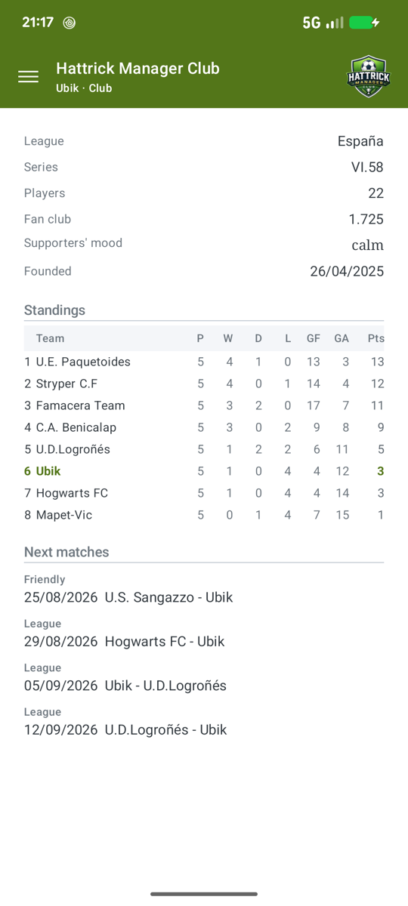
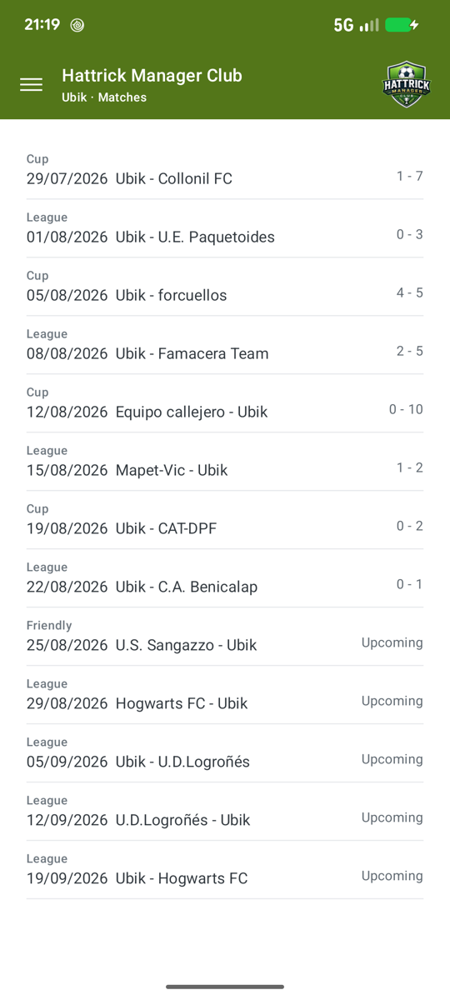
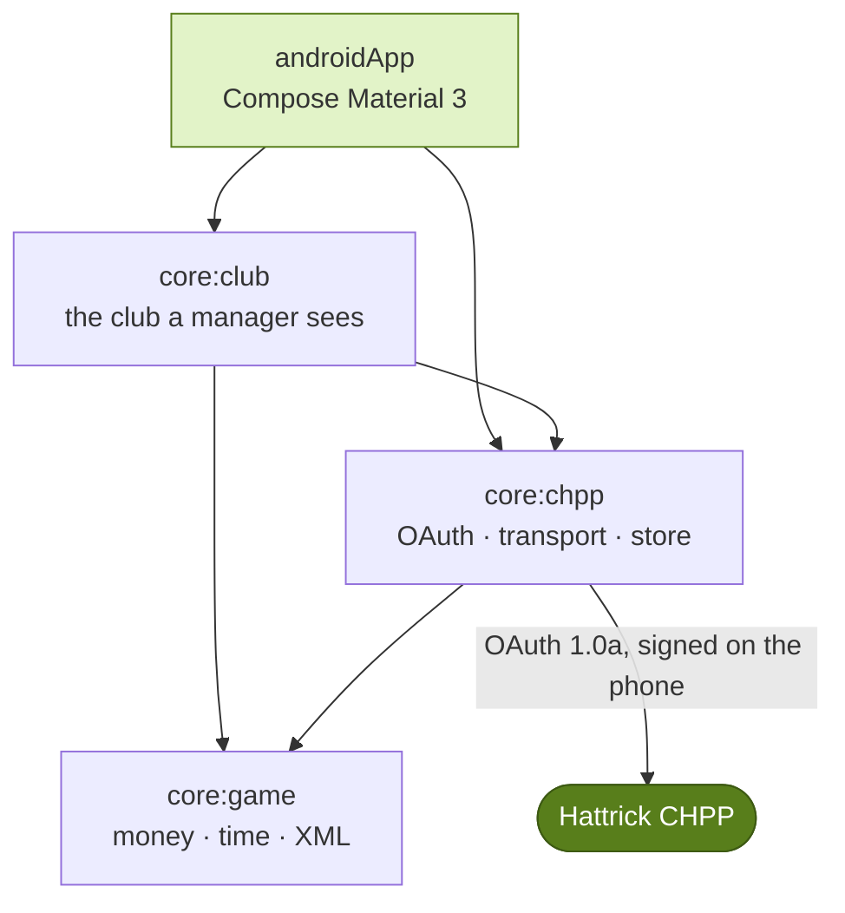
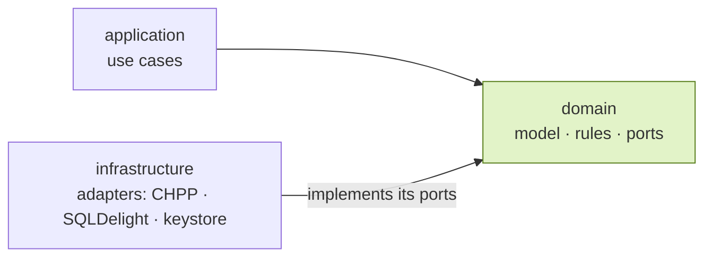

# Hattrick Manager Club

**Your club on your phone.**

Squad, skills, arena, economy, staff, training and fixtures in one place. 
Free, read-only, and nothing leaves your device.

### [**→ jcmoro.github.io/hmclub**](https://jcmoro.github.io/hmclub/)

[Product page](https://jcmoro.github.io/hmclub/) ·
[Privacy policy](https://jcmoro.github.io/hmclub/privacy.html) ·
[en español](https://jcmoro.github.io/hmclub/privacidad.html) ·
[Issues](https://github.com/jcmoro/hmclub/issues)

---

This repository holds the product page and the privacy policy — static HTML, no dependencies, no
trackers. The app itself lives in a separate repository. What follows is how that app is built.

Squad · Player · Club · Matches. Light and dark, following your phone or fixed from the app.

## Built once, for two phones

The domain, the CHPP client and the club reading are Kotlin Multiplatform. Only the screens are
written per platform, so a rule about what Hattrick means is written once and holds on both.

Each context keeps the same three layers, and the arrows only ever point inwards: the domain knows
nothing about Hattrick's XML, about SQL or about Android.

That is not a diagram of good intentions. **34 architecture rules** run on every push and fail the
build with file and line if the domain reaches for a framework, if one context reaches into
another, or if a screen carries a hardcoded string.

## What the numbers say

| | |
|---|---|
| **567 tests** | on the JVM, on Android and on the iOS simulator |
| **34 architecture rules** | Konsist, run as tests, no exceptions list |
| **13 CHPP files** | each with its own version and its own cache lifetime |
| **5 CI jobs** | nothing merges unless every one of them is green |
| **0 warnings** | a Kotlin warning fails the build; ktlint guards the style |

## Decisions worth naming

**There is no server.** The app signs its own requests from your phone and keeps what it downloads
there. The access token is sealed with AES-256-GCM under a key that never leaves the Android
Keystore — or the iOS Keychain, device-only — and both are kept out of device backups.

**The words come from Hattrick.** Skill levels, positions, specialties, training types and moods
are read from Hattrick's own `translations` file. Nothing is hardcoded, so nothing drifts and
everything reads right in any language.

**Unrevealed is not zero.** A skill Hattrick does not report is drawn differently from a skill at
level zero, because they are not the same thing. A test fixes that distinction.

**What gets stored is the raw XML**, not the mapped model. When a mapping turns out to be wrong,
the fix re-derives the whole history instead of leaving bad numbers frozen in a database.

**Mappings are written against captured documents**, never against what the documentation says.
Three bugs in a previous version came from a fixture and the code agreeing on the same wrong
assumption; real answers from Hattrick are what the tests read now.

**Failures report themselves.** If the app crashes, or Hattrick sends something it cannot read, it
opens an issue in this repository on its own — with the class, the line and the phone model, and
with nothing about your club, your players or your token.

---

A CHPP product, built by one Hattrick manager. 
Not affiliated with, endorsed by, or operated by Hattrick Holdings Limited. 
Hattrick and the Hattrick logo are theirs.

